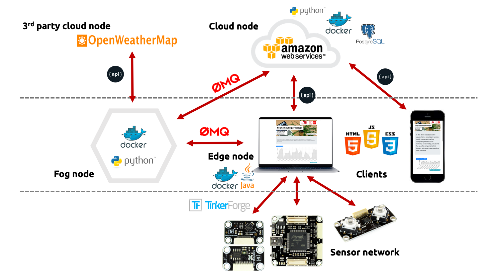
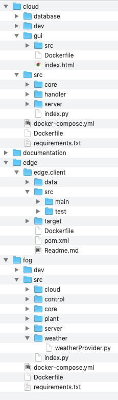

<center>
Fog Computing <br />
Supervisors: Prof. Dr.-Ing. David Bermbach, Martin Grambow, Jonathan Hasenburg <br />
 <br />
Chair Mobile Cloud Computing <br />
Faculty IV - Electrical Engineering and Computer Science <br />
Technical University of Berlin
</center>
<br />

# Abstract
In this project we observe live values with a smart plant service that is connected to a Fog Computing infrastructure including several edge, cloud and fog specific components that interact with great care regarding fault tolerance. The setup is easily extendable and built upon state-of-the-art technologies.


<div style="page-break-after: always;"></div>

# Architecture

|  |
|:--:|
| *Architecture* |


# Components
## Cloud
...

## Edge

The Edge Client is a light weight Maven - Java programm. It collects data from sensors and sends it to the fog. The application also communicates with the user and gives feedback about the current values.
The edge handles different sensors:
- 1..n humidity sensors
- 0..n temperature sensors
- 0..n ultraviolet sensors
- 1 button<br><br>
A sample setup looks like this:<br>

|  |
|:--:|
| *Sensors* |

### Overview

To start the java project:

```bash
install brickd https://www.tinkerforge.com/de/doc/Software/Brickd.html#brickd
install brickv https://www.tinkerforge.com/de/doc/Software/Brickv.html#brickv
cd edge\edge.client\
mvn clean package
java -jar -jar target\edge.client.jar 18.185.92.86 myplant vTy (h,HF1) (u,xkb) (t,EKx)
```
Firstly one has to define the address of the fog node. There after the name of the supervised plant, for example: "myplant", "vTy" is an example ID for the button and the tuples in the end present the sensors. "h" is humidity, "t" - temperature, "u" - ultraviolet and the second param the ID. <br>

To get reliable data one has to place the sensors directly on the plant. The humidity sensor should touch the potting soil. The ultraviolet sensor should be aligned to the sun.<br>

|  |
|:--:|
| *Plant setup* |

Afterward you are supposed to connect the sensors to the master brick and the master brick to a (cheap) edge device. For example a raspberry pi with speakers or a Mac Book Pro (not a common edge device).<br>

|  |
|:--:|
| *Overview* |

### Sequence diagramm

### Persistence

### Reliable messaging

### Message format

### Human interaction
<p style="text-align: center;">

|  |
|:--:|
| *LED button* |
</p>
## Fog

## Graphical User Interface/Frontend
In order to display historic but also current data, a Graphical User Interface was built upon standard web technologies such as HTML, CSS and JavaScript. Standard libraries were included such as _JQuery_, _Bootstrap_, and _Chart.js_. The user interface is served with an _nginx_ webserver and the deployment is _Docker_-ized. The page is responsive and renders correctly on different devices. The frontend supports different query parameters such as `sensor`, `limit`, `time` and `retry`. Example: http://localhost/?sensor=2&limit=50&time=1000&retry=1000

<center>

|  |
|:--:|
| *Frontend displayed on Desktop (left) and mobile (right) device* |

</center>
# Code structure
<center>

|  |
|:--:|
| *Filesystem tree* |

</center>
## We can make use of those templates.

```bash
mvn package
```

```javascript
dependencies {
  implementation files('libs/swagger-java-client-1.0.0.jar')
}
```

```java
List<License> allLicenses = new ArrayList<>();
…
Thread thread = new Thread(new Runnable() {
    @Override
    public void run() {
        LicensesApi apiInstance = new LicensesApi();
        try {
            allLicenses.clear();
            allLicenses.addAll(apiInstance.apiV10LicensesGet(null, null, null,
                    null, null, null, null));
            for (License l : allLicenses) {
                Log.d("LicenseFragment", "Loaded: " + l.getFullName());
            }
          } catch (ApiException e) {
              e.printStackTrace();
          }
        }
      }
```

```bash
curl -X GET --header 'Accept: application/json' 'https://www.opensense.network/beta/api/v1.0/licenses'
```


# Demo video
Please refer to https://www.youtube.com/watch?v=1XjiOtrxI_4 for a minimal demo.


# License
The software is licensed under GPLv3 [13] and is published as Open Source Software under https://github.com/fog-computing-tu-berlin/prototype.


# References

[1] A. Domingo, B. Bellalta, M. Palacin, M. Oliver and E. Almirall, "Public Open Sensor Data: Revolutionizing Smart Cities," in IEEE Technology and Society Magazine, vol. 32, no. 4, pp. 50-56, winter 2013. doi: 10.1109/MTS.2013.2286421 <br />
[2] https://www.gnu.org/licenses/gpl-3.0.en.html <br />
