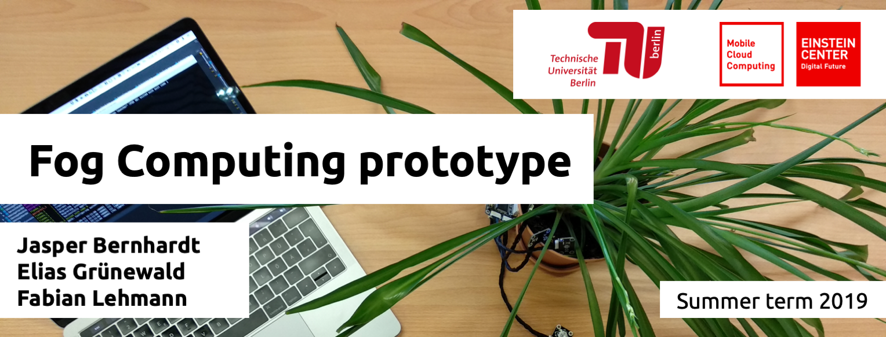
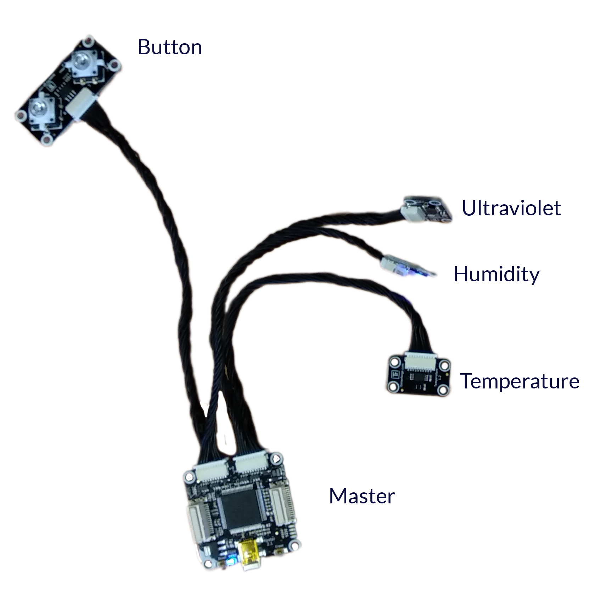
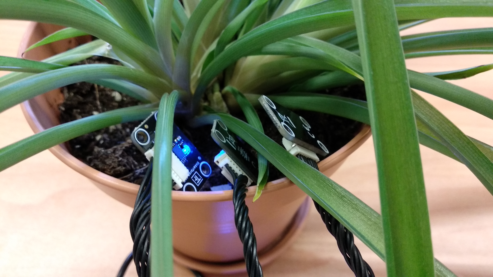
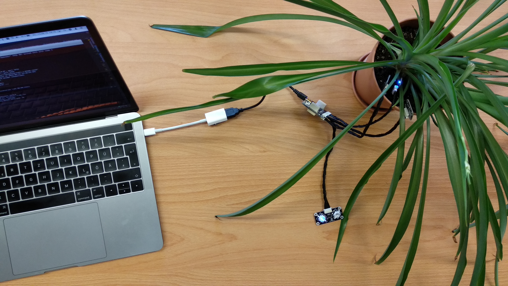

<center>
Fog Computing <br />
Supervisors: Prof. Dr.-Ing. David Bermbach, Martin Grambow, Jonathan Hasenburg <br />
 <br />
Chair Mobile Cloud Computing <br />
Faculty IV - Electrical Engineering and Computer Science <br />
Technical University of Berlin
</center>
<br />

# Abstract


<!--img src="tree.png" height="400px"></img-->


<div style="page-break-after: always;"></div>

# Architecture

# Components


## Fog

The is a Python Programm that heavily utilizes ZeroMQ and the multiple `asyncio` tasks to process incoming messages and cache messages in case of connection issues.
These routines are restarted in case of unexpected crashes. Mainly these tasks handle the internal queues for processing new control message for the Edge and uploading data to the Cloud. Additionally, one async-task is started per connected Edge device and published control messages periodically. Lastly one routine forwards requests for new edge ids to the cloud. Incoming messages from the Edge are only validate for a correct message format and then copied into internal queues to process them asynchronously. Upload of reports to the Cloud are uploaded in bulks periodically. The Fog is build with Docker and only has one Python-Interpreter (one CPU core) to process messages. If deployed on machines with multiple cores the fog might need a TCP Load Balancer.

These are all settings avaliable via enviroment variables for the Fog Container.

| ENV Variable                            | Default              | Description                                                                             |
| --------------------------------------- | :------------------- | --------------------------------------------------------------------------------------- |
| IS_DEBUG_LOGGING                        | `'False'`            | Enables a more verbose output                                                           |
| CONTROL_MESSAGE_TICK_RATE               | `4`                  | Tickrate of Fog -> Edge Control Message in Hz                                           |
| CONTROL_MESSAGE_TICKER_UPDATE_TIMEOUT   | `300000`             | Timout in Milliseconds                                                                  |
| EDGE_RECEIVER_LISTEN_PORT               | `5555`               | TCP Port for the Edge Receiver                                                          |
| EDGE_CONTROLLER_PORT                    | `5556`               | TCP Port tor the Edge Controller Message                                                |
| EDGE_ID_GENERATOR_LISTEN_PORT           | `5557`               | TCP Port for the Edge ID Relay                                                          |
| CLOUD_UPLOAD_URL                        | `'tcp://cloud:5558'` | Upstream URL for the Report Messages                                                    |
| EDGE_ID_UPSTREAM_URL                    | `'tcp://cloud:5559'` | Upstream URL for the Edge ID Relay                                                      |
| EDGE_RECEIVER_MAX_QUEUE_LENGTH          | `10000`              | ZeroMQ Max Queue Length for the Edge Receiver                                           |
| EDGE_ID_RELAY_MAX_QUEUE_LENGTH          | `10000`              | ZeroMQ Max Queue Length for the Edge ID Relay                                           |
| INTERNAL_MESSAGE_CACHE_MAX_QUEUE_LENGTH | `100000`             | ZeroMQ Max Queue Length for Caches                                                      |
| CLOUD_SUBMIT_TIMEOUT                    | `60000`              | Timout for Report Messages to Upstream                                                  |
| CLOUD_ID_RELAY_CLOUD_TIMEOUT            | `5000`               | Timout for Edge ID Relayed Messages to Upstream                                         |
| WEATHER_LIMIT_HOURS_IN_FUTURE           | `6`                  | Hours in forecast to consider for calculating Water & Light status                      |
| WEATHER_FORCE_ALWAYS_WATER_RETURN_VALUE | `-1`                 | Debug value to override the calculated value for a static; `-1` disables the override   |
| WEATHER_FORCE_ALWAYS_LIGHT_RETURN_VALUE | `-1`                 | Debug value to override the calculated value for a static; `-1` disables the override   |
| WEATHER_CITY                            | `'Berlin'`           | City to use for the weather forecast; See [OpenWeatherMap](https://openweathermap.org/) |


## Cloud


### REST API

A simple REST API build with [PostgREST 5.2](https://github.com/PostgREST/postgrest) and utilizing [PostreSQL](https://www.postgresql.org/) as Datastore for the Application. It only does validation of the message and restricts access to only `GET` and `POST` with relevant params. Basic filtering and Ordering are supported for the frontend.
They expose 4 relevant Endpoints:
- `GET` and `POST` ` http://<server>/sensor` with the following model
```json
{
  "id": "string",
  "edge_id": "string",
  "temperature": "integer",
  "temperature_sensor_id": "string",
  "humidity": "integer",
  "humidity_sensor_id": "string",
  "uv": "integer",
  "uv_sensor_id": "string",
  "started_at": "string",
  "stopped_at": "string"
}
```
- `GET` and `POST` ` http://<server>/edge_id`
```json
{
  "id": "integer",
  "plant": "string"
}
```

### ZeroMQ

The Cloud ZeroMQ is written in Python. It is build around ZeroMQ to accept messages from Fog clients. It is build similar to the Fog using `asyncio` for multiple loops to work off the Queue. Messages to the REST API are submitted in bulks periodically.

These are all settings avaliable via enviroment variables for the Cloud Container.

| ENV Variable                            | Default                    | Description                                             |
| --------------------------------------- | :------------------------- | ------------------------------------------------------- |
| IS_DEBUG_LOGGING                        | `'False'`                  | Enables a more verbose output                           |
| DATABASE_REST_URL                       | `'http://postgrest:3000/'` | Upstream URL for the Database REST Service              |
| FOG_RECEIVER_LISTEN_PORT                | `5558`                     | TCP Port for the Report Message from Fog                |
| ID_FOG_RECEIVER_LISTEN_PORT             | `5559`                     | TCP Port for the Edge ID Requests                       |
| FOG_RECEIVER_MAX_QUEUE_LENGTH           | `10000`                    | ZeroMQ Max Queue Length for the Report Message from Fog |
| ID_RECEIVER_MAX_QUEUE_LENGTH            | `10000`                    | ZeroMQ Max Queue Length for the Edge ID Requests        |
| INTERNAL_MESSAGE_CACHE_MAX_QUEUE_LENGTH | `100000`                   | ZeroMQ Max Queue Length for Caches                      |


## Edge

The Edge Client is a light weight Maven - Java programm. It collects data from sensors and sends it to the fog. The application also communicates with the user and gives feedback about the current values.
The edge handles different sensors:
- 1..n humidity sensors
- 0..n temperature sensors
- 0..n ultraviolet sensors
- 1 button<br><br>
A sample setup looks like this:<br>
<p align="center">

</p>
<br>

### Overview

To start the JAVA-project: 

```bash
install brickd https://www.tinkerforge.com/de/doc/Software/Brickd.html#brickd
install brickv https://www.tinkerforge.com/de/doc/Software/Brickv.html#brickv
cd edge\edge.client\
mvn clean package
java -jar -jar target\edge.client.jar 18.185.92.86 myplant vTy (h,HF1) (u,xkb) (t,EKx)
```
Firstly one has to define the address of the fog node. There after the name of the supervised plant, for example: "myplant", "vTy" is an example ID for the button and the tuples in the end present the sensors. "h" is humidity, "t" - temperature, "u" - ultraviolet and the second param the ID. <br>

To get reliable data one has to place the sensors directly on the plant. The humidity sensor should touch the potting soil. The ultraviolet sensor should be aligned to the sun.<br>
<p align="center">

</p>
Afterward you are supposed to connect the sensors to the master brick and the master brick to a (cheap) edge device. For example a raspberry pi with speakers or a Mac Book Pro (not a common edge device).<br>
<p align="center">

</p>

### Sequence diagramm

### Persistence

### Reliable messaging

### Message format

### Human interaction
button


# Code samples

## We can make use of those templates.

```bash
mvn package
```

```javascript
dependencies {
  implementation files('libs/swagger-java-client-1.0.0.jar')
}
```

```java
List<License> allLicenses = new ArrayList<>();
…
Thread thread = new Thread(new Runnable() {
    @Override
    public void run() {
        LicensesApi apiInstance = new LicensesApi();
        try {
            allLicenses.clear();
            allLicenses.addAll(apiInstance.apiV10LicensesGet(null, null, null,
                    null, null, null, null));
            for (License l : allLicenses) {
                Log.d("LicenseFragment", "Loaded: " + l.getFullName());
            }
          } catch (ApiException e) {
              e.printStackTrace();
          }
        }
      }
```

```bash
curl -X GET --header 'Accept: application/json' 'https://www.opensense.network/beta/api/v1.0/licenses'
```


# Demo video
Please refer to https://www.youtube.com/watch?v=1XjiOtrxI_4 for a minimal demo.


# License
The software is licensed under GPLv3 [13] and is published as Open Source Software under https://github.com/fog-computing-tu-berlin/prototype.


# References

[1] A. Domingo, B. Bellalta, M. Palacin, M. Oliver and E. Almirall, "Public Open Sensor Data: Revolutionizing Smart Cities," in IEEE Technology and Society Magazine, vol. 32, no. 4, pp. 50-56, winter 2013. doi: 10.1109/MTS.2013.2286421 <br />
[2] https://www.gnu.org/licenses/gpl-3.0.en.html <br />
