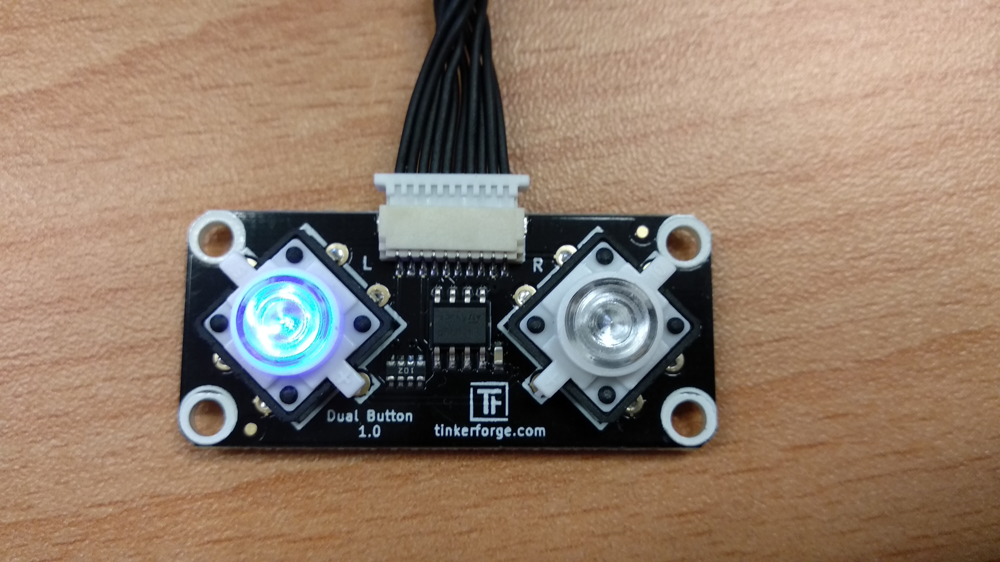

<center>
Fog Computing <br />
Supervisors: Prof. Dr.-Ing. David Bermbach, Martin Grambow, Jonathan Hasenburg <br />
 <br />
Chair Mobile Cloud Computing <br />
Faculty IV - Electrical Engineering and Computer Science <br />
Technical University of Berlin
</center>
<br />

# Abstract


<!--img src="tree.png" height="400px"></img-->


<div style="page-break-after: always;"></div>

# Architecture

# Components
## Cloud
...

## Edge

The Edge Client is a light weight Maven - Java programm. It collects data from sensors and sends it to the fog. The application also communicates with the user and gives feedback about the current values.
The edge handles different sensors:
- 1..n humidity sensors
- 0..n temperature sensors
- 0..n ultraviolet sensors
- 1 button<br>
A sample setup looks like this:<br>

<br>
To start the JAVA-project: 

```bash
install brickd https://www.tinkerforge.com/de/doc/Software/Brickd.html#brickd
install brickv https://www.tinkerforge.com/de/doc/Software/Brickv.html#brickv
cd edge\edger.client\
mvn clean package
java -jar -jar target\edge.client.jar 18.185.92.86 myplant vTy (h,HF1) (u,xkb) (t,EKx)
```
where "myplant" is the name of the supervised plant, "vTy" is an example ID for the button and the tuples in the end present the sensors. "h" is humidity, "t" - temperature, "u" - ultraviolet and the second param the ID. <br>

To get reliable data one has to place the sensors directly on the plant. The humidity sensor should touch the potting soil. The ultraviolet sensor should be aligned to the sun.<br>
<br>
Afterward you are supposed to connect the sensors to the master brick and the master brick to an (cheap) edge device. For example a raspberry pi with speakers or a Mac Book Pro (not a common edge device).<br>


### Sequence diagramm

### Persistence

### Reliable messaging

### Human interaction
button



## Fog


# Code samples

## We can make use of those templates.

```bash
mvn package
```

```javascript
dependencies {
  implementation files('libs/swagger-java-client-1.0.0.jar')
}
```

```java
List<License> allLicenses = new ArrayList<>();
…
Thread thread = new Thread(new Runnable() {
    @Override
    public void run() {
        LicensesApi apiInstance = new LicensesApi();
        try {
            allLicenses.clear();
            allLicenses.addAll(apiInstance.apiV10LicensesGet(null, null, null,
                    null, null, null, null));
            for (License l : allLicenses) {
                Log.d("LicenseFragment", "Loaded: " + l.getFullName());
            }
          } catch (ApiException e) {
              e.printStackTrace();
          }
        }
      }
```

```bash
curl -X GET --header 'Accept: application/json' 'https://www.opensense.network/beta/api/v1.0/licenses'
```


# Demo video
Please refer to https://www.youtube.com/watch?v=1XjiOtrxI_4 for a minimal demo.


# License
The software is licensed under GPLv3 [13] and is published as Open Source Software under https://github.com/fog-computing-tu-berlin/prototype.


# References

[1] A. Domingo, B. Bellalta, M. Palacin, M. Oliver and E. Almirall, "Public Open Sensor Data: Revolutionizing Smart Cities," in IEEE Technology and Society Magazine, vol. 32, no. 4, pp. 50-56, winter 2013. doi: 10.1109/MTS.2013.2286421 <br />
[2] https://www.gnu.org/licenses/gpl-3.0.en.html <br />
